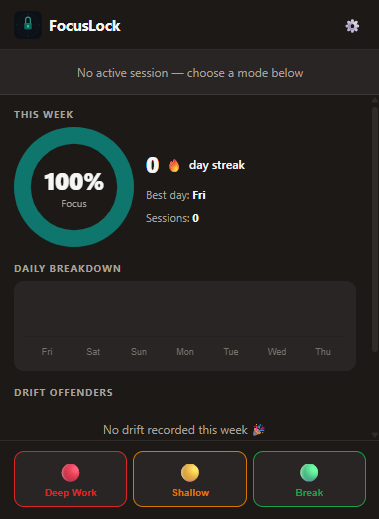
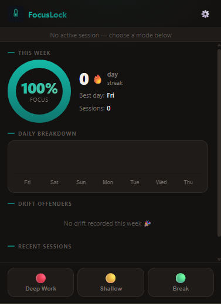
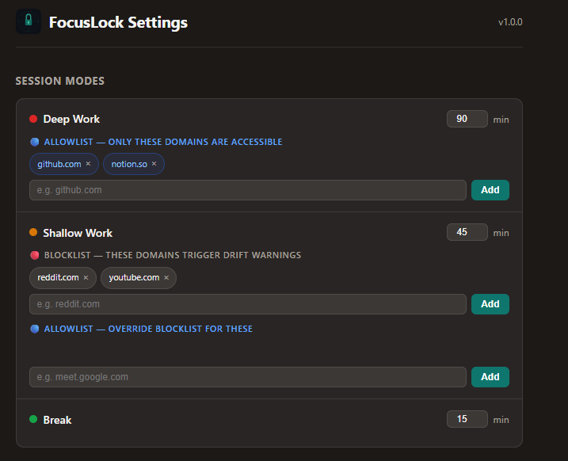
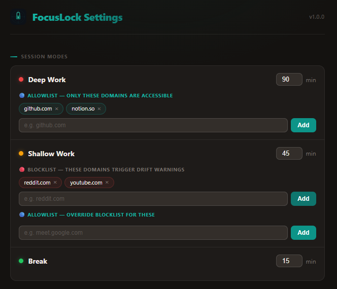
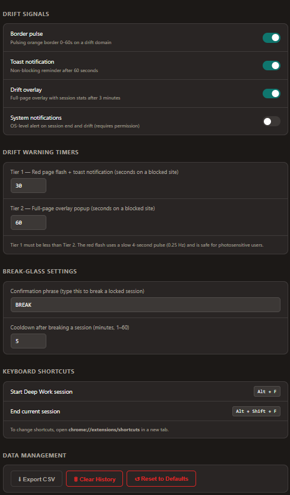
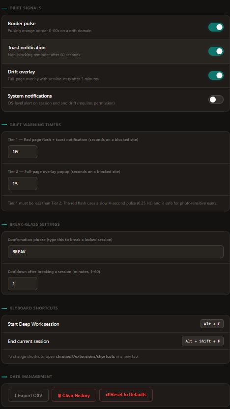

# FocusLock

**A Chrome extension that turns your browser into a distraction firewall during focused work sessions.**

Modern knowledge work demands long stretches of uninterrupted concentration, but browsers are designed to make that difficult. Every tab is one click away from Reddit, YouTube, or a social feed. Most "focus" tools either hard-block sites (which kills legitimate mid-session lookup needs) or rely on willpower alone (which doesn't scale). FocusLock takes a different approach: it uses **escalating friction** rather than hard blocks, paired with a **session accountability system** that makes distraction visible over time.

When you start a session, FocusLock monitors your browsing against a policy for that mode - a strict allowlist for Deep Work, a blocklist for Shallow Work. If you drift to a blocked site, it responds in stages: first a subtle orange border, then a slow red page flash with a toast, then a full-page overlay with your session stats and a one-click button to close every blocked tab across the browser. None of these block you outright - they surface the cost of the drift and put the choice back in your hands, deliberately.

At the end of each session, every drift event, break, and focus score is logged locally. Over a week, the dashboard builds a picture of your real browsing patterns: which domains pull you off task most, which days are your strongest, how your streak is tracking. That data stays entirely on your device in `chrome.storage.local` - no account, no sync, no telemetry.

Everything runs through native Chrome Extension APIs: `chrome.alarms` for timers that survive service worker suspension, `chrome.storage.local` for all persistence, `chrome.webNavigation` for tab monitoring, and Shadow DOM isolation for content scripts so they never interfere with page styles.

---

## Demo

<video src="docs/FocusLock.mp4" controls width="100%"></video>

---

## How It Was Built

This extension was built end-to-end using **Claude Code**, Anthropic's CLI coding agent, across two focused sessions.

### Phase 1 - Initial Implementation with `/feature-dev`

The session started from a product design document ([`FocusLock_Design_Document.docx`](docs/FocusLock_Design_Document.docx)) that specified the session model, drift detection tiers, domain policy engine, and the accountability dashboard. The `/feature-dev` skill was used to translate that spec directly into a working MV3 Chrome Extension:

- Parsed the `.docx` design document to extract requirements
- Generated the full extension file structure (`manifest.json`, service worker, background modules, content scripts, popup, options page)
- Implemented the `PolicyEngine`, `SessionManager`, `StorageManager`, `TimerController`, `EventBus`, `ReportBuilder`, and `IconManager` as separate ES modules
- Built the drift detection system with configurable Tier 1 / Tier 2 thresholds, seizure-safe red flash animation, and the full-page overlay with live blocklist editing
- Wired up Chart.js (bundled locally) for the popup dashboard charts
- Added a Chrome API mock stub so the popup and options page render correctly in a browser preview without an extension context

### Phase 2 - UI Refinement with `/frontend-design`

Once the extension was functional, the `/frontend-design` skill was used to redesign the visual layer with a clear point of view rather than generic defaults:

- Established a **dark-first design system** - tokens for background, surface, border, and accent layers with a teal primary palette (`#0F766E` → `#14B8A6`)
- Applied **teal gradient text** to the FocusLock wordmark in both popup and options headers
- Redesigned the session bar with a **mode-colored ambient overlay**, glowing mode badge, monospace countdown, and a live **progress bar** that fills as the session runs
- Mode selector buttons now respond with **colored hover states** (red/amber/green tint, soft shadow, 1px lift) and highlight the active mode
- Session log rows gained **colored left borders** by mode for instant visual scanning
- Donut chart updated with a **gradient arc fill** and gradient score text
- Options page mode dots got **colored glow effects**, toggle switches gained a glow on activation, and all inputs use a consistent teal focus ring
- Removed excess whitespace in empty domain list sections

---

## Before & After

### Popup Dashboard

| Before | After |
|:---:|:---:|
|  |  |

### Options Page - Session Modes

| Before | After |
|:---:|:---:|
|  |  |

### Options Page - Signals, Timers & Controls

| Before | After |
|:---:|:---:|
|  |  |

---

## Features

### Session Modes

Start a session to activate FocusLock. Each mode enforces a different domain policy:

| Mode | Default Duration | Policy |
|---|---|---|
| 🔴 **Deep Work** | 90 min | Only allowlisted domains accessible; everything else triggers drift warnings |
| 🟡 **Shallow Work** | 45 min | Blocklisted (and seed-blocked) domains trigger drift warnings; everything else is accessible |
| 🟢 **Break** | 15 min | All sites accessible; session is still logged for accountability |
| ⚪ **Off** | - | Passive mode; no tracking |

**Session lock:** Once a session starts, the settings gear is disabled. You cannot change modes mid-session without breaking it via the break-glass flow.

---

### Drift Detection (Escalating Friction - No Hard Blocks)

FocusLock never prevents navigation. It creates *visible friction* so you can self-correct.

| Time on Blocked Site | Signal |
|---|---|
| **Immediately** | Subtle orange pulsing border around the page viewport |
| **Tier 1 threshold** (default 30 s) | Full-page **red flash** (slow 4-second pulse, seizure-safe at 0.25 Hz) + toast |
| **Tier 2 threshold** (default 60 s) | Full-page **overlay popup** with session stats and action buttons |

The overlay offers three responses:
- **Get Back to Work** - closes every blocked tab across the entire browser instantly
- **Allow for this session** - adds the domain as a one-time exception, logged in the report
- **Add to blocklist / remove from blocklist** - edit the list inline without leaving the page

#### Customising Drift Timers

In **Settings → Drift Warning Timers**:

| Profile | Tier 1 | Tier 2 |
|---|---|---|
| Strict | 15 s | 30 s |
| Default | 30 s | 60 s |
| Relaxed | 60 s | 120 s |

---

### Session Lock & Break-Glass

To end a session early: click **End** → type your break-glass phrase (default: `BREAK`). A **5-minute cooldown** is enforced before the next session. The break is logged with timestamp, time remaining, and optional reason.

Customise the phrase in **Settings → Break-Glass Settings**.

---

### Domain Policy Engine

- **Deep Work allowlist** - only listed domains are accessible; everything else drifts
- **Shallow Work blocklist** - listed domains (plus the 50-domain seed list) trigger warnings
- **Allowlist override** - in Shallow Work, allowlisted domains bypass the blocklist
- **Subdomain collapsing** - `www.reddit.com` and `old.reddit.com` both match `reddit.com`; two-part TLDs (`co.uk`, `com.au`) handled correctly
- **Seed blocklist** - 50 pre-loaded high-distraction domains including Reddit, YouTube, X, Instagram, TikTok, Facebook, Twitch, Netflix, Discord

---

### Weekly Accountability Dashboard

| Panel | What it shows |
|---|---|
| **Focus Score** | % of active browsing time spent on-policy (donut chart) |
| **Streak counter** | Consecutive days with Focus Score ≥ 70% |
| **Daily breakdown** | Hours in Deep Work / Shallow Work / Break per day (stacked bar) |
| **Drift Offenders** | Top domains by total drift time this week |
| **Session Log** | Last 8 sessions - mode, duration, score |

**Focus Score formula:** `(session time − drift time) / session time × 100`

---

### Options Page

| Section | What you can configure |
|---|---|
| **Session Modes** | Duration (1–480 min), allowlist and blocklist per mode |
| **Drift Warning Timers** | Tier 1 and Tier 2 thresholds in seconds |
| **Drift Signals** | Toggle border pulse, toast, overlay, and system notifications |
| **Break-Glass Settings** | Confirmation phrase and cooldown duration |
| **Keyboard Shortcuts** | Read-only display (configure at `chrome://extensions/shortcuts`) |
| **Data Management** | Export CSV, clear history, reset to factory defaults |

---

### Keyboard Shortcuts

| Shortcut | Action |
|---|---|
| `Alt + F` | Start a Deep Work session immediately |
| `Alt + Shift + F` | End the current session |

---

## Installation

1. Clone or download this repository
2. Open `chrome://extensions/` in Chrome
3. Enable **Developer mode** (toggle in the top-right)
4. Click **Load unpacked**
5. Select the `focus_lock/` folder

---

## Privacy

All session data is stored in `chrome.storage.local` on your device. No backend, no analytics, no telemetry, no account required. Storage estimate: < 400 KB for 500 sessions.

---

## Architecture

```
focus_lock/
├── manifest.json              MV3 manifest
├── background.js              Service worker - orchestrates all logic
├── background/
│   ├── SessionManager.js      Session lifecycle (start / end / break)
│   ├── PolicyEngine.js        Domain resolution - O(1) Set lookups
│   ├── TimerController.js     chrome.alarms-based countdown
│   ├── StorageManager.js      All chrome.storage.local I/O
│   ├── ReportBuilder.js       Weekly stats aggregation
│   ├── EventBus.js            Message broadcasting
│   └── IconManager.js         Toolbar icon + badge updates
├── content/
│   ├── border.js              Orange border (tier-0) + red flash (tier-1)
│   ├── toast.js               Shadow DOM toast notification (tier-1)
│   └── drift_overlay.js       Full-page overlay popup (tier-2)
├── popup/                     Dashboard + session controls
├── options/                   Settings page
├── icons/                     SVG source + PNG at 16/48/128px
├── docs/                      Screenshots
├── lib/chart.min.js           Chart.js v4.4.0 (bundled)
└── seed/blocklist.json        50 default blocked domains
```

---

## Roadmap

- [ ] Firefox support
- [ ] Sync settings via `chrome.storage.sync`
- [ ] Pomodoro integration (automatic break scheduling)
- [ ] Custom session mode count (> 3 modes)
